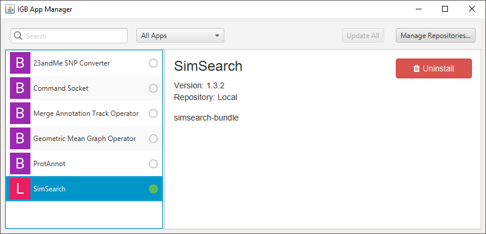

.. SimSearch App documentation master file, created by
   sphinx-quickstart on Sun Jan  5 00:12:17 2020.
   You can adapt this file completely to your liking, but it should at least
   contain the root `toctree` directive.

Installation
=========================================
 
In order to use the SimSearch plugin, you should first install IGB, and load the plugin from the App manager. In addition, 
it is possible to add the SimSearch Quickload server that contains useful data to start using SimSearch

Install the Integrated Genome Browser (IGB)
-------------------------------------------

The SimSearch plugin is an extension for the Integrated Genome Browser (IGB)
that can be downloaded from `<http://bioviz.org/igb/>`_.

Add the SimSearch app
---------------------

Since IGB version 1.9.1 , apps are available from the App Store.
 

Add the SimSearch Quickload server (facultative)
------------------------------------------------

In order to make it easy to test the SimSearch plugin, we have compiled a
Quickload repository with public data (mostly from ENCODE and Roadmap 
Epigenomics projects) for the human hg19 genome. 

   
.. image:: images/quickload.png

To access this repository go to
"**data access**", "**configure**", "**add...**", and add the
repository: name: "**SimSearch**" url:
`<https://deib-geco.github.io/simsearch-quickload/>`_. To speed up the plugin, you can 
also `download <https://github.com/deib-geco/simsearch-quickload/archive/gh-pages.zip>`_ the 
Quickload directory and use it locally.
	